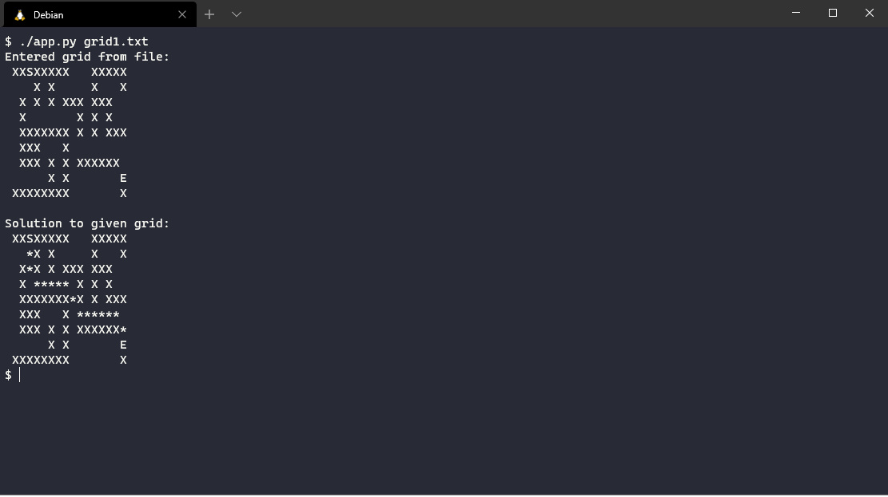

# A* Pathfinding command line in Python
A* pathfinding meant to be run on a terminal/command line and will calculate the shortest path between a start and ending position while avoiding walls/obstacles specified by a text file passed as an argument to the application. 'X' characters are walls, ' ' (Space) characters are open space that is traversable, 'S' character represents the start position and 'E' represents the ending position.

## Assumptions:
The application must be passed a gridfile in the proper format.

### Proper Format:
- One 'S' character to represent the starting position
- One 'E' character to represent the ending position
- 'X' characters to represent walls and or obstacles
- ' ' (Spaces) to represent an open area that is traversable

### Instructions:
- Make sure the text file in proper format is in the same directory as the application
- run the application by typing "python3 app.py (text file)" or "./app.py (text file)"

